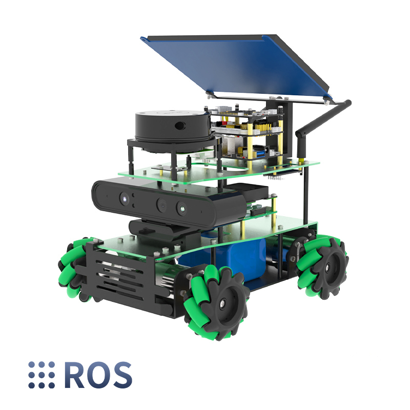
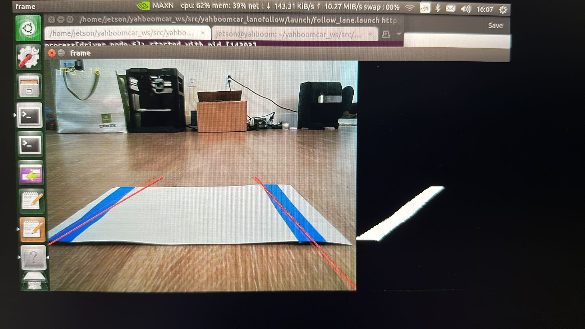

# Lane Following Robot

- [Overview](#overview)
- [Key Features](#key-features)
- [Project Structure](#project-structure)
  - [Software](#software)
  - [Hardware](#hardware)
- [Results](#results)
- [Conclusion](#conclusion)
- [References](#references)
- [Project Slides](EGR530_Lane_Following.pptx)

## Overview

The project aims to develop a fully functional lane-following robot capable of autonomous navigation. Leveraging the Jetson Nano platform and OpenCV, the robot will process real-time camera data to make navigation decisions.

- **Fig 1:** ROSMASTER X3 Hardware Platform
---
## Key Features

- Utilization of Jetson Nano for real-time image processing.
- High accuracy in lane detection and tracking.
- Adaptability to different lighting conditions.
- Compact, lightweight, and energy-efficient design.
---
## Project Structure

### Hardware Setup:
- Selection and assembly of necessary components.
- Integration of Jetson Nano board, camera module, chassis, drive system, motors, and power source.
- Functional testing of hardware components.

### Software Setup:
- Installation of required software tools and libraries.
- Configuration of development environment for Jetson Nano.
- Calibration of camera module and development of lane detection algorithm.

### Steering Control:
- Development of control algorithm based on lane detection data.
- Parameter tuning for optimal performance.
- Testing under various scenarios including curves, intersections, and lane changes.

### Testing and Optimization:
- Extensive testing under diverse conditions.
- Incorporation of user feedback for improvements.
- Performance optimization for accuracy and reliability.

### Documentation and Presentation:
- Project documentation covering hardware, software, algorithms, and findings.
- Preparation of a presentation to demonstrate the project.

### Software

- Utilization of OpenCV for real-time image processing.
- Development of algorithms for lane detection and tracking.
- Possible integration of machine learning frameworks for advanced decision-making.

### Hardware

- Jetson Nano board for processing power.
- High-quality camera module for real-time video capture.
- Sturdy chassis and drive system.
- Precise motors and controllers.
- Adequate power source for sustained operation.
---
## Results

The project aims to achieve:

- Successful autonomous navigation of the lane-following robot.
- High accuracy in lane detection and tracking.
- Adaptability to various lighting conditions.
- Optimal performance under different scenarios.
- Optionally, integration of machine learning for enhanced decision-making.

- **Fig 2:** Lane Detection Testing

- **Lane Following Testing**
---
## Conclusion

The lane-following robot project, leveraging Jetson Nano and OpenCV, demonstrates the successful implementation of autonomous navigation capabilities. Through robust hardware integration and sophisticated software algorithms, the robot achieves high accuracy in lane detection and adapts effectively to diverse lighting conditions. The optional integration of machine learning further enhances its decision-making abilities, making it a versatile solution for various road scenarios. Overall, the project showcases a comprehensive approach to developing a compact, lightweight, and energy-efficient autonomous robot for lane following.
---
## References

1. http://www.yahboom.net/study/ROSMASTER-X3
2. http://wiki.ros.org/Documentation
3. https://learnopencv.com/color-spaces-in-opencv-cpp-python/
---
## Acknowledgment
We appreciate the support from Professor Junfeng Zhao.
